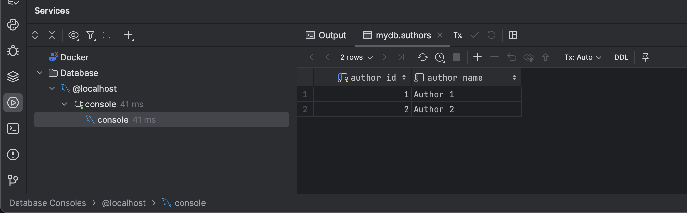
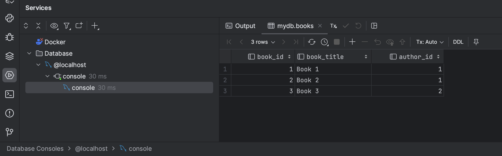
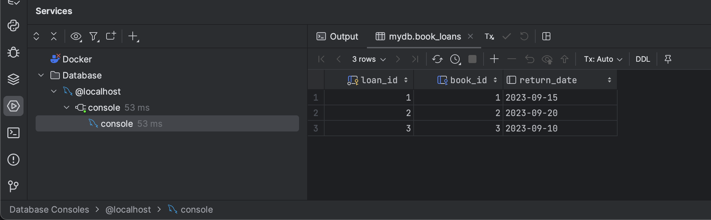
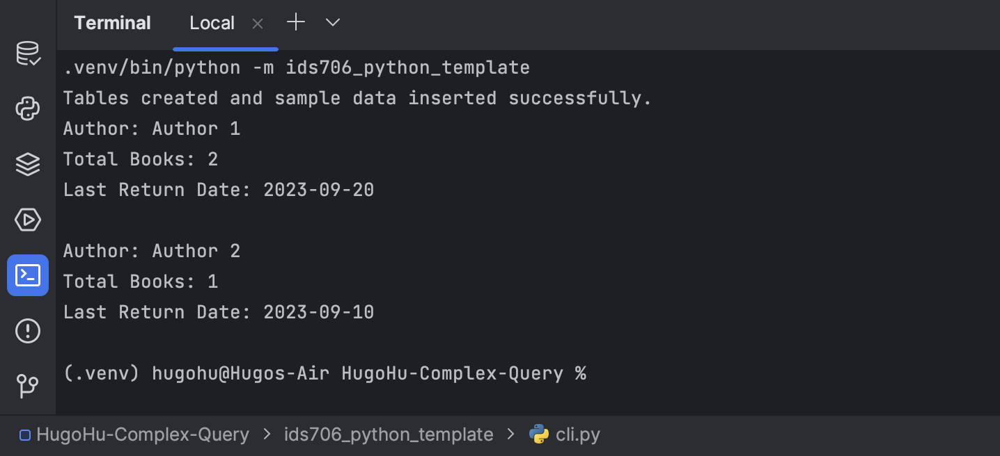

[](https://github.com/nogibjj/HugoHu-Complex-Query/actions/workflows/install.yml)

[](https://github.com/nogibjj/HugoHu-Complex-Query/actions/workflows/lint.yml)

[](https://github.com/nogibjj/HugoHu-Complex-Query/actions/workflows/format.yml)

[](https://github.com/nogibjj/HugoHu-Complex-Query/actions/workflows/test.yml)

## Week 7 (Swapped) Mini-project

> © Yadong (Hugo) Hu 2023
> 
> This project was generated by this [Awesome Template](https://github.com/0HugoHu/IDS706-Python-Template)

<br />

**Requirements: Design a complex SQL query for a MySQL database and explain the results.**


## Project Description
Create three tables in MySQL database: ```authors```, ```books```, ```book_loans```:






### Complex Query
This query join these three tables and will return the total number of books and the last return date of each author. If the author has no book, the total number of books will be 0 and the last return date will be NULL.
```sql
SELECT
    authors.author_name,
    COUNT(books.book_id) AS total_books,
    MAX(loan_history.return_date) AS last_return_date
FROM
    authors
LEFT JOIN
    books ON authors.author_id = books.author_id
LEFT JOIN
    book_loans AS loan_history ON books.book_id = loan_history.book_id
GROUP BY
    authors.author_name
ORDER BY
    last_return_date DESC;
```

### Results


## Run

### Some Makefile Commands
```commandline
make clean
make install
make format
make lint
make test
make run
```
